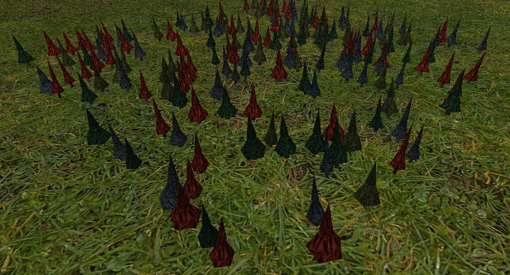
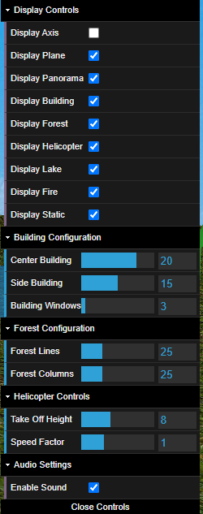

# CG 2024/2025

## Group T01G04

Pedro Marinho (**up202206854**) & Sérgio Nossa (**up202206856**)

## Project Notes

All the required functionalities were implemented, along with some additional features to enhance the overall experience.

Below is an overview of the main features implemented:

- Full support for all mandatory requirements.
- Additional functionalities, such as **sound vfx** and visual improvements added.
- In **Stage 7**, we implemented the optional **Feature C**: improved lake representation using a mask and shaders.

## Project Components

### 1 - Helicopter Model

#### Controls

- **W / A / S / D** – Move the helicopter
- **C** – Focus the camera on the helicopter
- **P** – Ascend
- **L** – Descend  
  - If descending, over water, the **bucket will start to be filled**
- **O** – Drop water from the bucket

#### Stationary

The helicopter was modeled in **Blender**, and each component was exported using a custom **Python script**. This script parsed the model data, extracting vertices, indices, and other necessary information for rendering.

The result is shown below:

#### Animations

##### Flying

During flight, the helicopter **deploys its bucket** while the **rotor blades (helices) animate** to simulate realistic motion.

##### Ascending / Descending

When the helicopter ascends or descends from the **Main Building**, the **helipad dynamically changes its texture** between the "up/H" and "down/H" states.

Additionally, the **helipad lights gradually change color over time**, creating a **pulsing visual effect**.

##### Filling Up the Bucket

When the helicopter approaches the **lake to fill its bucket**, a **visual effect is triggered on the water surface**, simulating the disturbance caused by the helicopter's proximity. This adds a more **realistic and immersive perspective** to the scene.

Once the bucket is completely filled, its **appearance updates accordingly**, and this change remains visible as the helicopter ascends.

##### Extinguishing Flames

When the helicopter **drops water**, all flames **within the affected radius** are successfully **extinguished**. 

##### Cruising Around

In this demonstration, the helicopter is shown **roaming freely** around the environment using the provided controls. This showcases smooth movement and camera tracking as the player navigates the scene.

### 2 - Fire Model

#### Animation

The fire is animated with a **continuous undulating effect**, giving it a more **realistic and dynamic appearance**. This subtle movement helps simulate the natural behavior of flames and enhances the overall visual immersion.

### 3 - Lake / Ground Plane Model

The **lake** and the **ground plane** were generated using a **black and white mask** in combination with **custom shaders**. 

- The **black areas** of the image represent **water**, forming the shape of the lake.
- The **white areas** represent the **terrain** or ground plane.

### 4 - Fire Station Model

This is the **Fire Station building**, designed as the central structure of the scene.

- It features a **helipad** on the rooftop, complete with **animated lights**.
- There are **two side buildings**, symmetrically placed on each side of the main structure.

### 5 - Forest Model

This is an example of a **forest scene**, composed of trees with a variety of **foliage textures** and **trunk textures**.

- The trees differ in **size**, **tilt**, and **appearance**, creating a more **natural and diverse environment**.
- This variation helps break repetition and adds realism to the overall landscape.
 

### 6 - Panorama Model

This model simulates the **panoramic background** of our world, helping to create a sense of **scale and immersion**.

- It surrounds the environment to give the impression of a larger world beyond the playable area.
- This adds depth and visual continuity, enhancing the overall atmosphere of the scene.

### 7 - Control Bar

The **Control Bar** provides an interactive interface to **modify various parameters** of the previously mentioned models.

- It allows real-time adjustments to elements such as **animation speed**, **object visibility** and other configurable features.
- This enhances user control and helps in testing or demonstrating specific behaviors within the scene.

### 7 - Final Product

This is the final result of our project: a **structured and interactive environment** where the player can **navigate through the world** and **extinguish fires** using the helicopter.

- The scene combines all the previously developed components into a cohesive simulation.
- Players experience dynamic interactions, visual effects, and realistic behaviors in a fully integrated environment.

